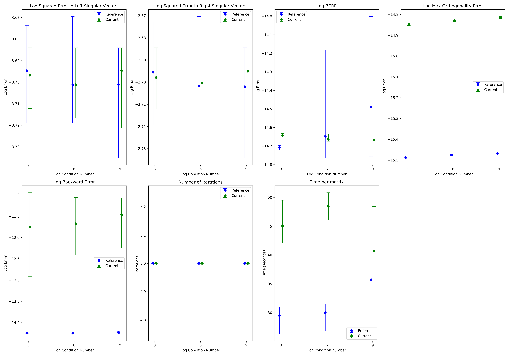

# Implementation and Testing of the Spectral Divide and Conquer Algorithm

## Introduction
This repository is an implementation of the spectral divide and conquer algorithm (2). We implement simplified versions of `QDWH`, `QDWH eig`, and `QDWH SVD` algorithms. Further, we compare our implementation with the reference by Nakatsukasa (3).

## Repository Structure

This repository contains 3 folders:
1. `./current_implementation` - this folder contains the files with our implementation of the aforementioned algorithms.
2. `./original_implementation` - this folder contains the reference implementations (3).
3. `./figures` - this folder contains the figure with various benchmarks.

Additionally, the root folder contains the `viz.ipynb` file, which was used to produce the figure with various benchmarks.

## Results

After implementing the QR-based dynamically weighted Halley or "QDWH" algorithm along with its extensions "QDWHeig" and "QDWHsvd", we tested the implementation in the following way. We computed the left and right singular values of 10000 by 1000 real matrix A, where A admitted the following singular values:

1. sigma_k = 1 / k
2. sigma_k = 1 / (k^2)
3. sigma_k = 1 / (k^3)

We generated the matrix A by first creating random column orthogonal matrices U, V, and Sigma, and then computing A as U Sigma V^T. Furthermore, we computed 10 such matrices A and then computed the left and right singular vectors (given by the columns of U hat and V hat respectively) along with the singular values (given by the diagonal entries of Sigma hat) using the "QDWHsvd" algorithm. We then obtained the values of the following 8 metrics averaged over the 10 random matrices.

1. The squared error associated with the left singular vectors.
2. The squared error associated with the right singular vectors.
3. The squared error associated with the singular values.
4. The backward error.
5. The orthogonality error associated with U hat and V hat.
6. The "berr" metric.
7. The number of iterations the "QDWH" algorithm was invoked.
8. The time required to process the matrix by the "QDWH" algorithm.

The results of the current implementation along with the reference implementation by the authors of (2) are presented in the figure below. The error bars represent the range between the minimum and the maximum metric value observed during the 10 trials.


*Figure: Benchmark Results Comparing Current and Reference Implementations*

## Reproducing the Results

To reproduce our results, follow the instructions below:

1. **Set up a Python virtual environment and install dependencies:**

    On **Linux** or **Mac**:
    ```bash
    python3 -m venv venv
    source venv/bin/activate
    pip install matplotlib numpy ipykernel
    ```

    On **Windows**:
    ```bash
    python -m venv venv
    .\venv\Scripts\activate
    pip install matplotlib numpy ipykernel
    ```

2. Using the Matlab code editor, change into the `current_implementation` directory and in the terminal execute `large_matrix_test(10000, 1000)`. This produces the benchmark results of our implementation.
3. Copy the terminal output into the string referenced by the `current` variable in `viz.ipynb`.
4. Next, change into the `original_implementation` directory and in the terminal execute `large_matrix_test(10000, 1000)`. This produces the benchmark results of the reference implementation.
5. Copy the terminal output into the string held by the `reference` variable in `viz.ipynb`.
6. Run all cells in the notebook to reproduce the figure.

## Authors

- Vadym Koval, EPFL
- Alexander Sharipov, EPFL

## References

1. Yuji Nakatsukasa, Zhaojun Bai, and François Gygi. Optimizing Halley’s iteration for computing the matrix polar decomposition. SIAM J. Matrix Anal. Appl., 31(5):2700–2720, 2010.
2. Yuji Nakatsukasa and Nicholas J. Higham. Stable and efficient spectral divide and conquer algorithms for the symmetric eigenvalue decomposition and the SVD. SIAM J. Sci. Comput., 35(3):A1325–A1349, 2013.
3. https://ch.mathworks.com/matlabcentral/fileexchange/36830-symmetric-eigenvalue-decomposition-and-the-svd
